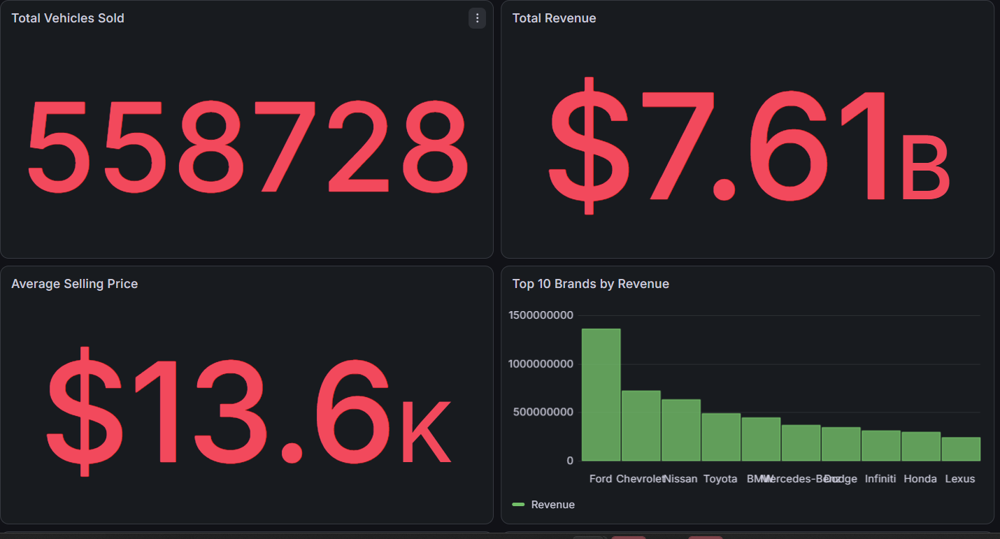
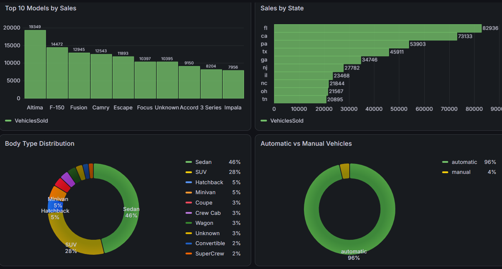
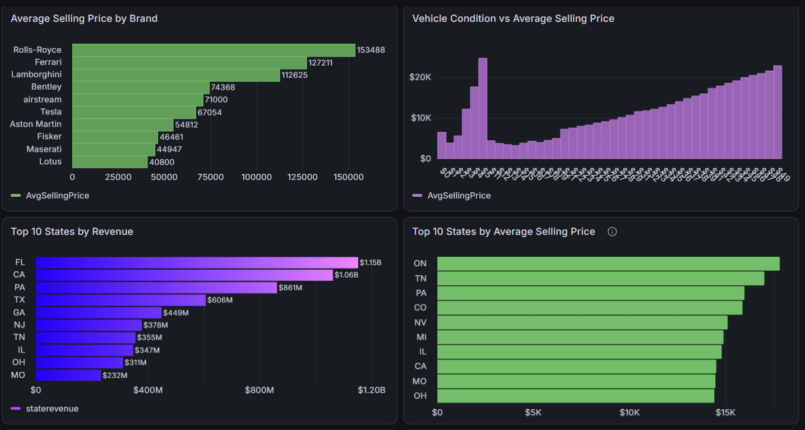
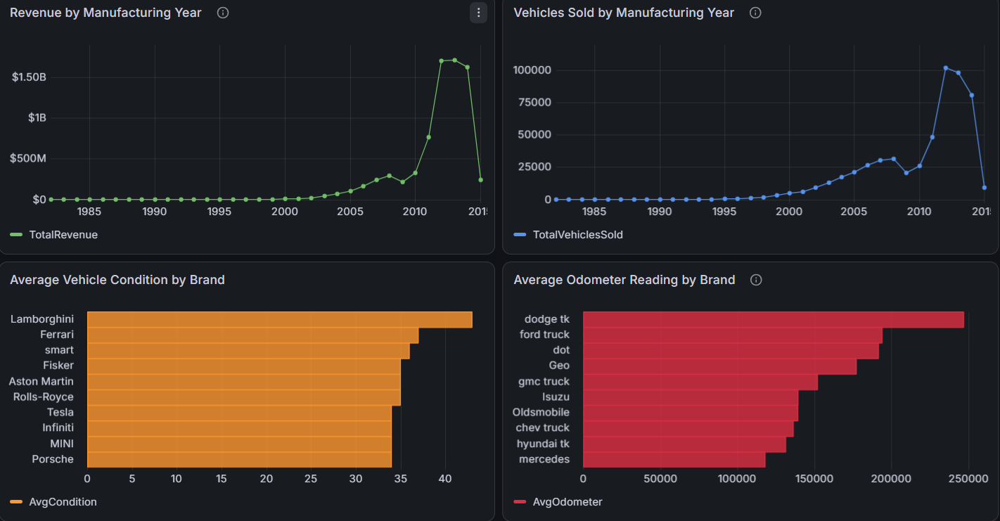
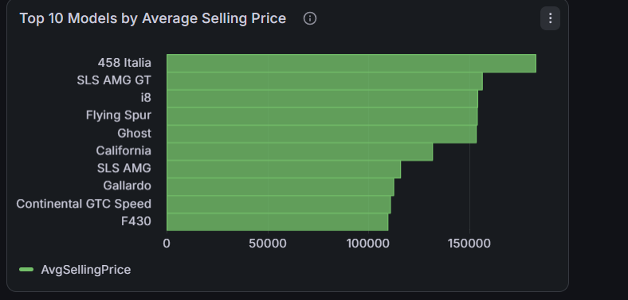

# 🚗 Vehicle Sales Analytics Dashboard

## 📌 Project Overview

This project analyzes vehicle sales data using SQL Server and Grafana to provide business insights through an interactive dashboard.

The dashboard helps identify sales performance, revenue trends, top-performing brands, popular vehicle models, regional sales distribution, and pricing patterns.

---

## 🎯 Objectives

- Analyze overall vehicle sales performance
- Identify top-performing brands and models
- Compare revenue across states
- Study body type and transmission distribution
- Analyze vehicle pricing and condition
- Track yearly revenue and sales trends

---

## 🛠️ Tools & Technologies

- SQL Server
- Grafana
- SQL
- Data Analysis
- Business Intelligence

---

## 📊 Dashboard KPIs

- Total Vehicles Sold
- Total Revenue
- Average Selling Price

---

## ❓ Business Questions

1. How many vehicles were sold?
2. What is the total revenue?
3. What is the average selling price?
4. Which brands generate the highest revenue?
5. Which models sell the most?
6. Which states have the highest sales?
7. What is the body type distribution?
8. Automatic vs Manual vehicle ratio?
9. Which brands have the highest average selling price?
10. How does vehicle condition affect selling price?
11. Which states generate the highest revenue?
12. Which states have the highest average selling price?
13. Revenue by manufacturing year?
14. Vehicle sales by manufacturing year?
15. Which brands have the best vehicle condition?
16. Which brands have the highest odometer readings?
17. Which models have the highest average selling price?

---

## 📷 Dashboard Preview

### Dashboard Overview



### Sales Analysis



### Market Analysis



### Yearly Trends



### Model Analysis



---

## 📈 Key Insights

- Ford generated the highest revenue.
- Sedan is the most common vehicle body type.
- Automatic vehicles dominate the dataset.
- Florida recorded the highest vehicle sales.
- Luxury brands have the highest average selling prices.
- Revenue increased significantly for newer manufacturing years.

---

## 📂 Repository Structure

```text
Vehicle-Sales-Dashboard
│
├── README.md
├── VehicleSales_Analysis.sql
├── Business_Questions.md
└── Dashboard_Screenshots
```

---

## ⭐ Skills Demonstrated

- SQL Query Writing
- Data Cleaning
- Data Aggregation
- Dashboard Development
- KPI Design
- Business Analysis
- Data Visualization
- Reporting
